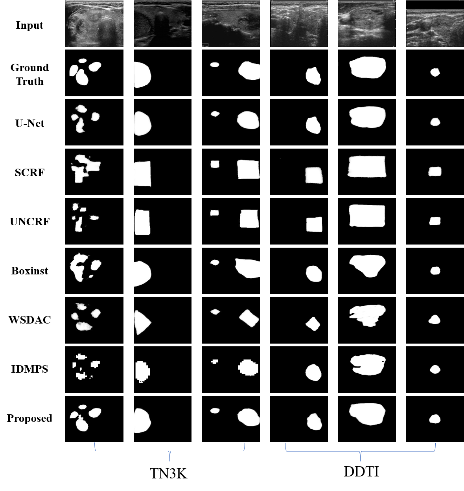

# PAplusNet

Welcome to the official repository for the paper: "Beyond Point Annotation: A Weakly Supervised Network Guided by Multi-Level Labels Generated from Four-Point Annotation for Thyroid Nodule Segmentation in Ultrasound Images."


## Results visualization
![Feature heatmap results of ablation experiments. Compared to the baseline model that directly uses point-generated pseudo-label masks for supervision, incorporating Distance Similarity Prior (DS) not only greatly improves the model's ability to locate the target, but also significantly enhances shape learning, leading to better segmentation with a more accurate fit for the target with segmentation. However, there is still an under-segmentation problem for small targets. By adding alignment loss (La), our algorithm can more accurately locate the segmentation target, but further improvements are needed for shape fitting. With the inclusion of contrastive loss (Lc), the model's shape fitting improves further, and it can largely reflect the shape features of segmented targets. Combining La and Lc further improves both localization and shape fitting, but the shape fitting issue still remains. By combining DS with La or DS with Lc, better segmentation results can be achieved, but there are still some under-segmentation and over-segmentation regions. By combining all three modules, we can obtain segmentation results that are on par with fully supervised segmentation, achieving satisfactory results.](ablation_heatmap.png)
**Feature heatmap results of ablation Experiments.** Compared to the baseline model that directly uses point-generated pseudo-label masks for supervision, incorporating Distance Similarity Prior (DS) not only greatly improves the model's ability to locate the target, but also significantly enhances shape learning, leading to better segmentation with a more accurate fit for the target with segmentation. However, there is still an under-segmentation problem for small targets. By adding alignment loss (La), our algorithm can more accurately locate the segmentation target, but further improvements are needed for shape fitting. With the inclusion of contrastive loss (Lc), the model's shape fitting improves further, and it can largely reflect the shape features of segmented targets. Combining La and Lc further improves both localization and shape fitting, but the shape fitting issue still remains. By combining DS with La or DS with Lc, better segmentation results can be achieved, but there are still some under-segmentation and over-segmentation regions. By combining all three modules, we can obtain segmentation results that are on par with fully-supervised segmentation, achieving satisfactory results.



**Prediction results of comparative experiments.** Comparative experiments have demonstrated the effectiveness of our algorithm, achieving good segmentation on multiple targets, small targets, and complexly shaped targets on two datasets

## Environment Requirements

To run this project, ensure you have the following software installed:
- Python 3.7 or higher
- PyTorch 1.8 or higher

You can create a virtual environment and install the required packages with:

```bash
# Create a new conda environment
conda create -n your_env_name python=3.7

# Activate the conda environment
conda activate your_env_name

# Install PyTorch and torchvision
pip install torch==1.8.0 torchvision==0.9.0  # Adjust according to your CUDA version
```


## Dataset Preparation
```
The dataset structure required for this network should be organized as follows:
├── main
├── models
├── utils
├── data/          # the dataset folder
    ├── train      # train dataset
        ├── imgs    
        ├── gt      
        └── labels  # point labels .json
    ├── val        # val and test dataset
        ├── imgs
        ├── gt
        └── labels
```

## Dataset Preprocessing
Before training, you need to preprocess the dataset using the point labels to generate the dissimilarity prior and multi-level labels. The generated prior and labels will be saved at the same folder level as the 'imgs'.

Run the following command to preprocess the dataset:
```bash
python utils/data_pre.py --data_name "your prepocess dataset"
```
Replace "your_preprocess_dataset" with the name of your dataset.

## Training the Network
To train the network, use the following command:
```bash
python main/train.py --arch "model name " --dataset "dataset name" --epochs "training epochs"
```

## Inference
To perform inference with the trained model, use the following command:
```bash
python main/inference.py --arch "model name " --train "the model trained on which dataset" --dataset "inference dataset name" --epochs "training epochs"
```
Replace the placeholders:
"model_name": The name of the model architecture.
"trained_model_name": The name of the model that was trained on the dataset.
"inference_dataset_name": The name of the dataset you want to run inference on.
"training_epochs": The number of epochs for which the model was trained.

## License
This project is licensed under the MIT License.

## Citation
If you use this code in your research, please cite our paper:
```
@article{chi2024beyond,
  title={Beyond Point Annotation: A Weakly Supervised Network Guided by Multi-Level Labels Generated from Four-Point Annotation for Thyroid Nodule Segmentation in Ultrasound Image},
  author={Chi, Jianning and Li, Zelan and Wu, Huixuan and Zhang, Wenjun and Huang, Ying},
  journal={arXiv preprint arXiv:2410.19332},
  year={2024}
}
```
